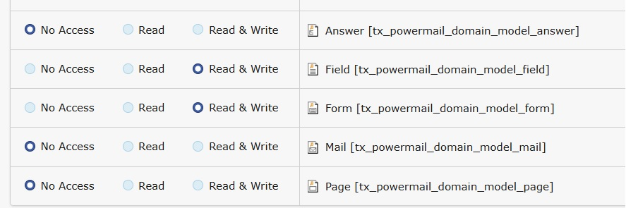
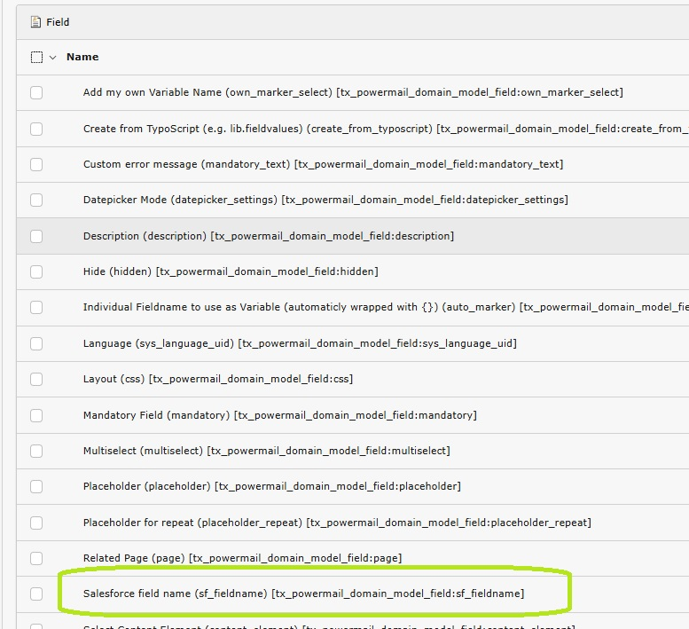
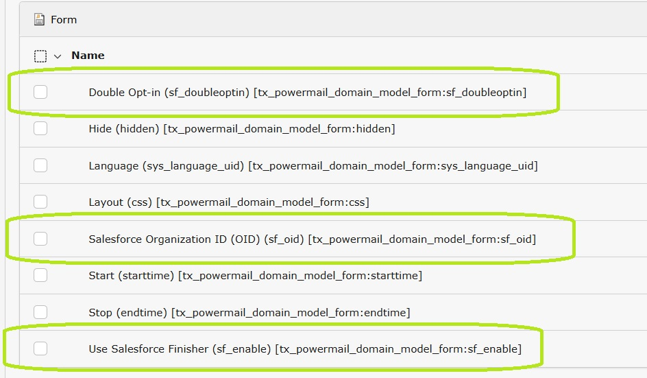

.. _backend-user-settings:

Backend user settings
===

All settings described in the :ref:`Editors manual <user-manual>` are configured as exclude fields.

This means each field must be explicitly allowed for the editor user or user group.

.. note::
   See :ref:`Backend user permissions <permissions>` and :ref:`Allowed exclude fields <allowedFields>` for more information.

Allow relevant fields
---

Switch to the :guilabel:`Backend Users > Backend user groups` module

Edit the appropriate user group and switch to the :guilabel:`Access Rights` tab.

.. important::
   To add or modify the relevant fields, the group must have permission to list (read) and modify (write) Powermail's `Form` and `Field` tables.

   See :ref:`Table permissions <tablePermissions>` for more information.

   Allow EXT:powermail's Form and Field tables

In the `Allowed excludefields` section of the same group, follow these steps to enable the necessary fields:

1) Go to the `Field` table. Here, the administrator decides which fields the editor is allowed to see and use. Allow the following fields:

   - **Salesforce field name** (sf_fieldname) [tx_powermail_domain_model_field:sf_fieldname]

2) Go to the `Form` table. The administrator determines which fields are accessible to the editor. Allow the following fields:

   - **Use Salesforce Finisher** (sf_enable) [tx_powermail_domain_model_form:sf_enable]
   - **Salesforce Organization ID** (OID) (sf_oid) [tx_powermail_domain_model_form:sf_oid]
   - **Double Opt-in** (sf_doubleoptin) [tx_powermail_domain_model_form:sf_doubleoptin]

   Allow the applicable fields for the `Field` table

   Allow the applicable fields for the `Form` table

.. _permissions: https://docs.typo3.org/permalink/t3coreapi:setting-up-user-permissions
.. _allowedFields: https://docs.typo3.org/permalink/t3coreapi:access-lists-allowed-excludefields
.. _tablePermissions: https://docs.typo3.org/permalink/t3coreapi:access-lists-tables
