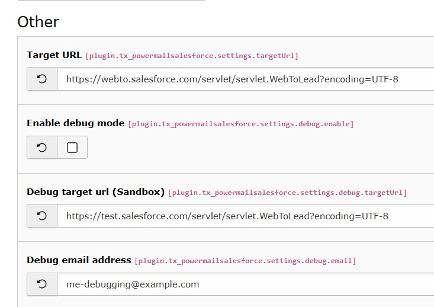
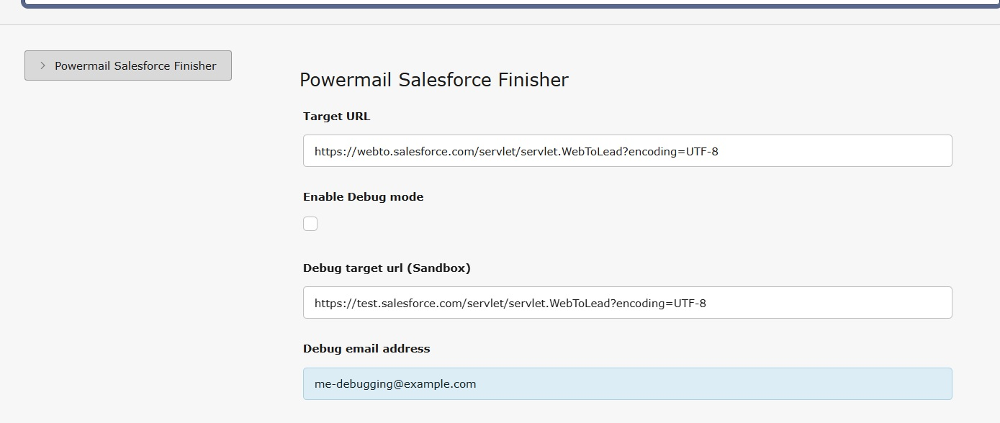

.. _debugging:

Debug mode
===

Depending on how you included the extension's configuration you have 2 options:

A) via Constants editor/ TypoScript Constants
---

   Use the constant editor to enable debug mode (Don't forget your email address!)

B) via Site Settings
---

    Use the site settings to enable debug mode (Don't forget your email address!)

