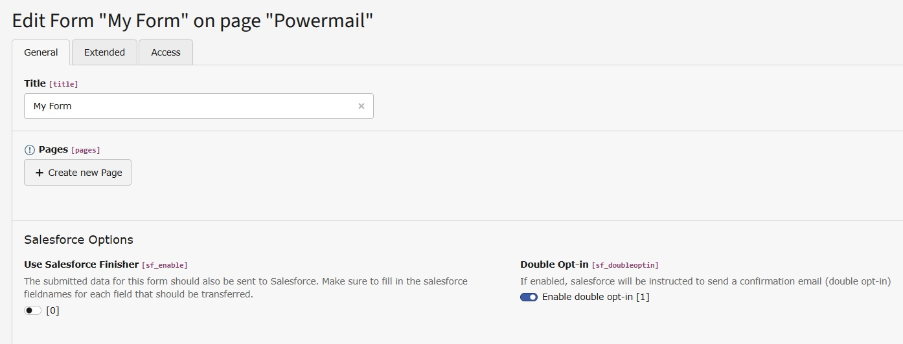
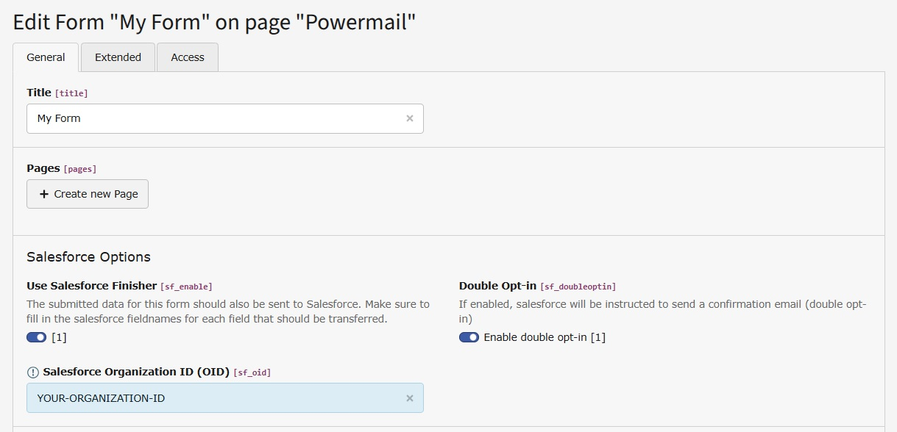

.. _user-manual-form:

Forms
===

With this extension the powermail Forms get 3 extra fields at the bottom.

Use Salesforce Finisher
~~~

If enabled, the submitted data for this form is transmitted to Salesforce after submit.

.. tip::
    Make sure to fill in the salesforce fieldnames for each field that should be transferred.

Salesforce Organization ID (OID)
~~~

Enter your Salesforce Organization ID / orgId / OID. This is required if you enable the Salesforce Finisher for this form.

.. tip::
    `How to find your OID <https://help.salesforce.com/s/articleView?id=000385215&type=1>`_

Double Opt-in
~~~

This is enabled by default.

If disabled, an additional **lead_source** value (Single-Opt-in) is transmitted. If you haven't setup a Single-Opt-in lead_source, you can ignore this setting and leave it enabled.

   Configuration in a Form when Salesforce Finisher is disabled

   Configuration in a Form when Salesforce Finisher is enabled

