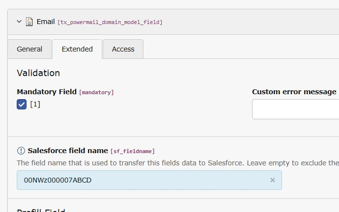

.. _user-manual-form:

Fields
===

With this extension the powermail Fields get 1 extra field in the extended tab:

Salesforce field name
---

Depending on your configuration in Salesforce WebToLead, enter the fieldname of the WebToLead-Form

.. note::
    If a Field's data should **NOT** be transmitted to Salesforce, leave this field empty.

   Configuration in a Field

Transmitting specific values
~~~

For select, multiselect, checkbox or radio fields, make sure the correct values are submitted.

The values that are transmitted to Salesforce must exactly match the values configured in WebToLead.

Example 1
A typical data protection checkbox should only transfer the value ``1`` when checked

Enter the checkbox text followed by ``|1``::

    By checking this checkbox I say that I checked the Lorem ipsum data protection|1

Example 2:
A single select box with some very specific values

We use the same approach, enter the labels followed by ``|`` and the value that should be transmitted::

    – Keine –|
    Produkt 1|Product_Value_foo
    Produkt 2|Product_Value_bar
    Produkt 3|Product_Value_baz

See `Option examples for selectbox <https://docs.typo3.org/p/in2code/powermail/13.0/en-us/ForEditors/FieldSelect.html#option-examples-for-selectbox>`_

