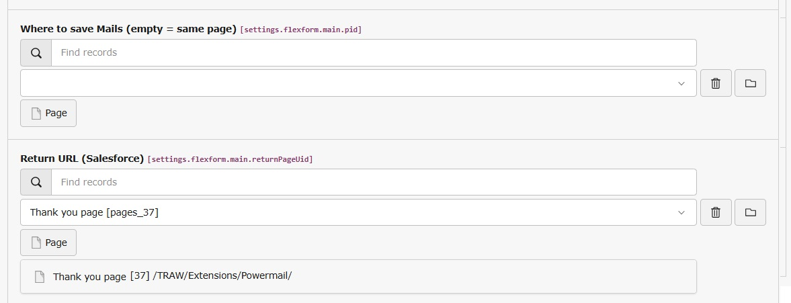

.. _user-manual-plugin:

Powermail plugin
===

In the powermail plugin there's a new optional field to set the ``Salesforce Return URL``

This field is used to generate the ``Return URL``, which is transmitted to Salesforce.WebToLead

If the field is empty, the field ``Redirect to any other Page after submit`` field is used instead.

If that field is empty as well, the uid of the page where the form is rendered is used instead.

   Return URL field in the plugin
